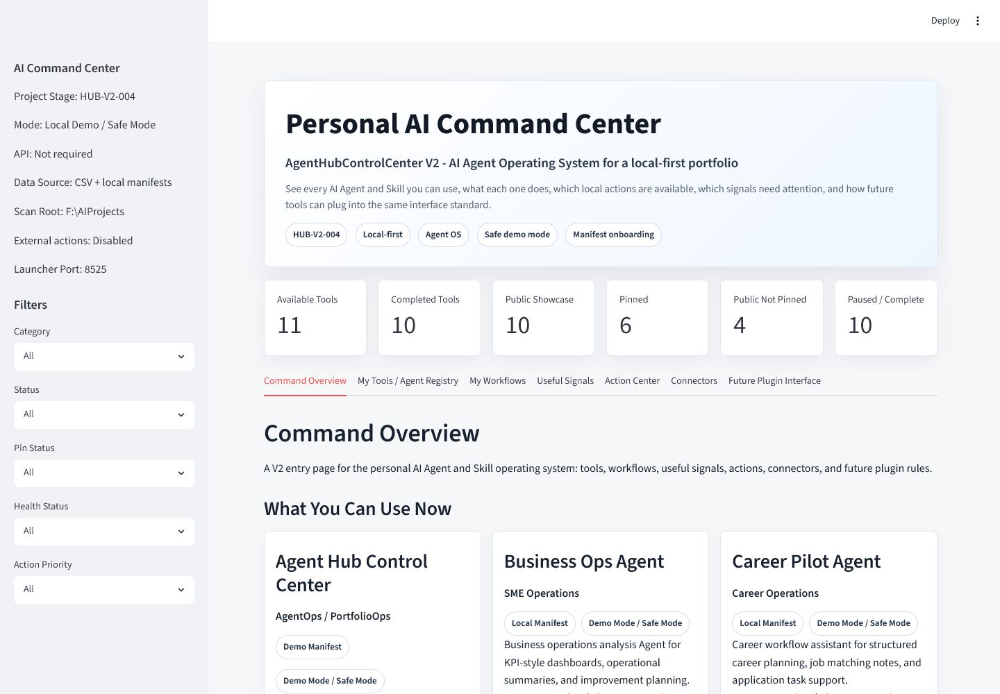
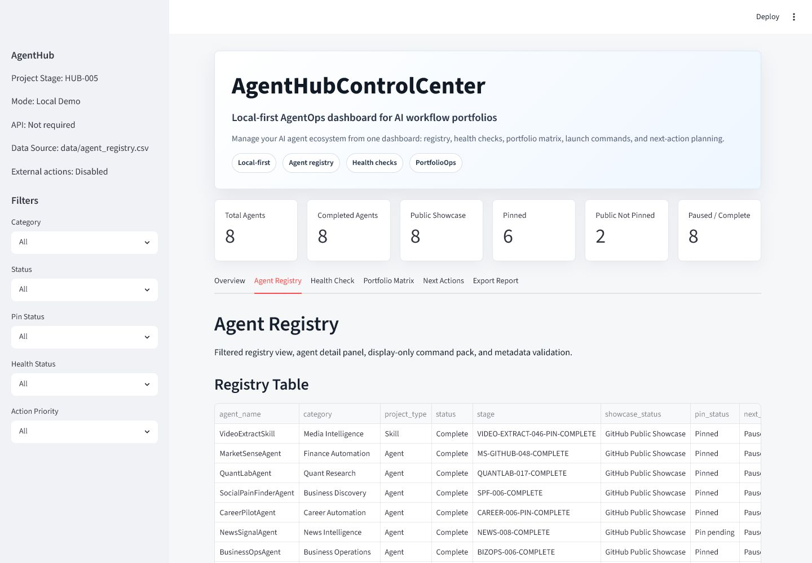
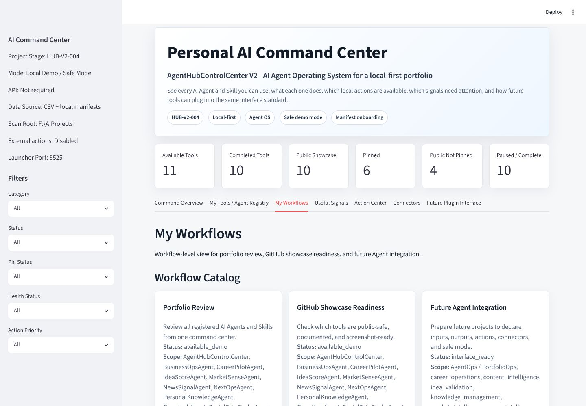
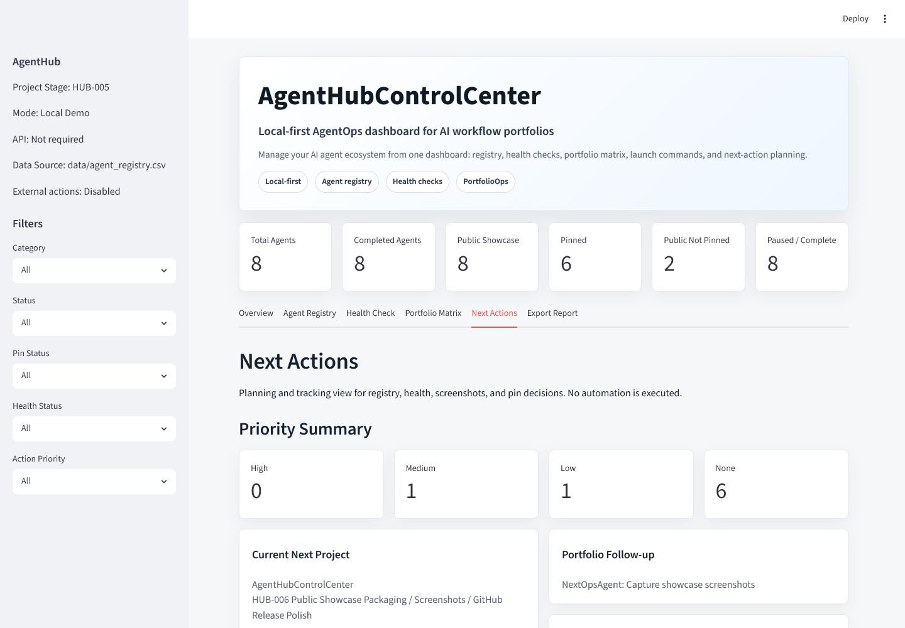
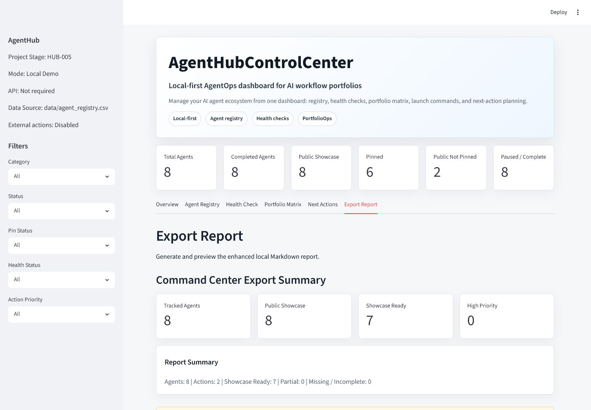
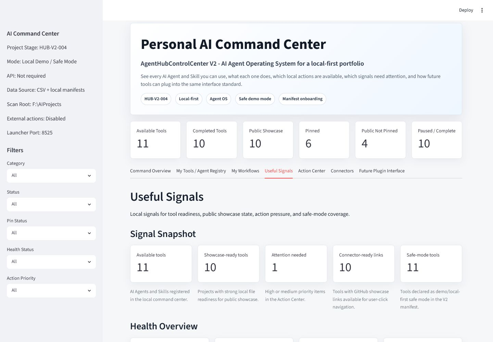

# AgentHubControlCenter

AgentHubControlCenter is a local-first AgentOps command center for managing AI
Agent and Skill portfolio projects. It gives one dashboard for the registry,
local health checks, GitHub showcase links, portfolio capability coverage,
display-only command packs, next actions, and portfolio positioning.

Current status: HUB-007-GITHUB-PUBLIC-RELEASE-COMPLETE

## What It Does

- Loads a local CSV registry of AI Agent and Skill projects.
- Validates registry metadata quality and missing required fields.
- Summarizes portfolio status, showcase coverage, pinned items, public-but-not-pinned projects, and paused/completed projects.
- Checks whether each local project path contains expected public-project files.
- Builds a capability matrix and positioning summary for the portfolio.
- Builds a fixed project matrix view across Finance / Market, Media / OCR / Extraction, Career, News / Signal, SME Automation, Knowledge Base, and Control Center / Meta Agent.
- Plans prioritized next actions from validation, health, screenshots, and pin status.
- Displays local command packs for manual launch, folder open, tests, and git status.
- Generates an enhanced Markdown portfolio report for download or local saved export.
- Builds a Command Center Summary and public-safe showcase asset checklist.
- Builds a Priority Action Summary for paused projects, future commercial candidates, GitHub showcase projects, and future AgentHub integration candidates.

## Why This Project Matters

As the portfolio grows, each project needs a clear operational view: what exists,
where it lives, whether the local files are healthy, what it demonstrates, and
what needs attention next. This app acts as a PortfolioOps dashboard for a
local-first AI workflow ecosystem.

## Screenshots

### Command Center Overview



Public-safe command center home view with portfolio metrics and summary cards.

### Portfolio Metrics



Registry overview showing local demo portfolio coverage without credential or
private path exposure.

### Project Matrix View



Capability-group matrix for positioning AI Agent and Skill projects in the
portfolio.

### Priority Action Summary



Next-action planning view for screenshot, showcase, and pin decision readiness.

### Report Export Preview



Local Markdown report preview and export summary for portfolio documentation.

### Public Showcase Readiness



Health overview for public-showcase file readiness and local structure checks.

## Core Features

- Product-style Streamlit dashboard
- Command center hero section
- Six metric cards
- Agent registry table with sidebar filters
- Agent detail panel
- Command pack display
- Registry validation with quality scores
- Health overview cards
- Priority action cards
- Portfolio matrix and capability clusters
- Fixed project matrix view
- Screenshot-ready layout
- Enhanced Markdown report generation and download
- Saved local report export to `outputs/`
- Command Center report summary
- Priority action summary
- Public showcase readiness section
- Showcase asset checklist

## Current MVP Status

HUB-006 packages the completed HUB-005 product UI for GitHub public showcase.
It adds public-safe screenshot assets under `docs/images/`, updates the README
screenshot section, refreshes showcase docs, and records final packaging
verification.

The app feature scope remains HUB-005: Command Center Summary, fixed project
matrix view, Priority Action Summary, public showcase readiness, stable report
file naming, and optional local save action for `outputs/`.

It does not call OpenAI APIs, does not create credentials, does not push to
GitHub, and does not execute external actions.

## Registered Agents

- VideoExtractSkill
- MarketSenseAgent
- QuantLabAgent
- SocialPainFinderAgent
- CareerPilotAgent
- NewsSignalAgent
- BusinessOpsAgent
- NextOpsAgent

## Tech Stack

- Python 3.11+
- Streamlit
- pandas
- pytest

## How To Run

```powershell
cd F:\AIProjects\AgentHubControlCenter
python -m pip install -r requirements.txt
streamlit run app.py
```

Run tests:

```powershell
cd F:\AIProjects\AgentHubControlCenter
python -m pytest
python -m compileall .
```

## Safety Boundary

This dashboard is for local portfolio management and workflow planning only. It
does not execute external actions or access private credentials.

The project intentionally avoids `.env` creation, API integrations, token reads,
credential storage, remote initialization, and GitHub push operations in HUB-006.

## Roadmap

- GitHub Public Release: complete.
- Profile Pin Decision: pending user decision.
