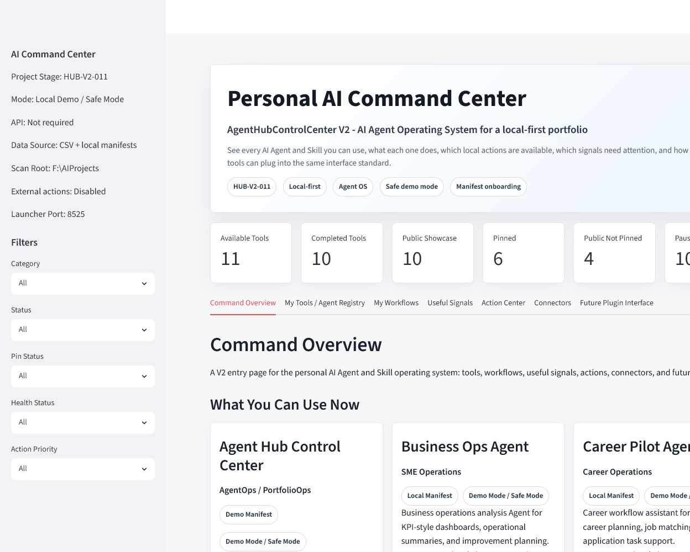
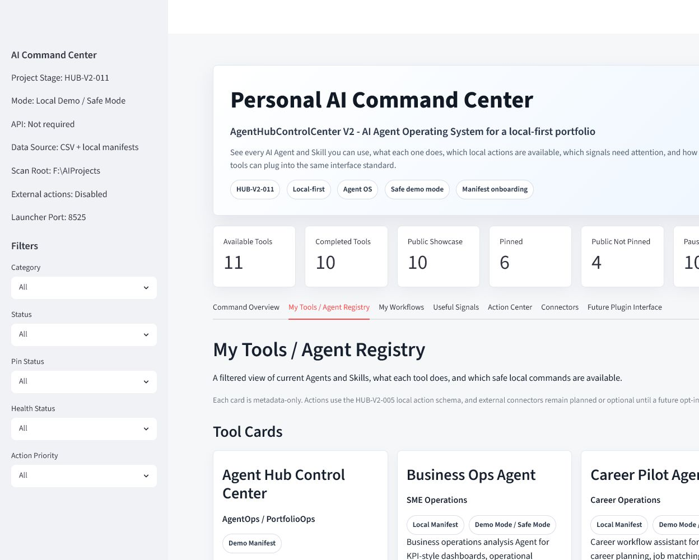
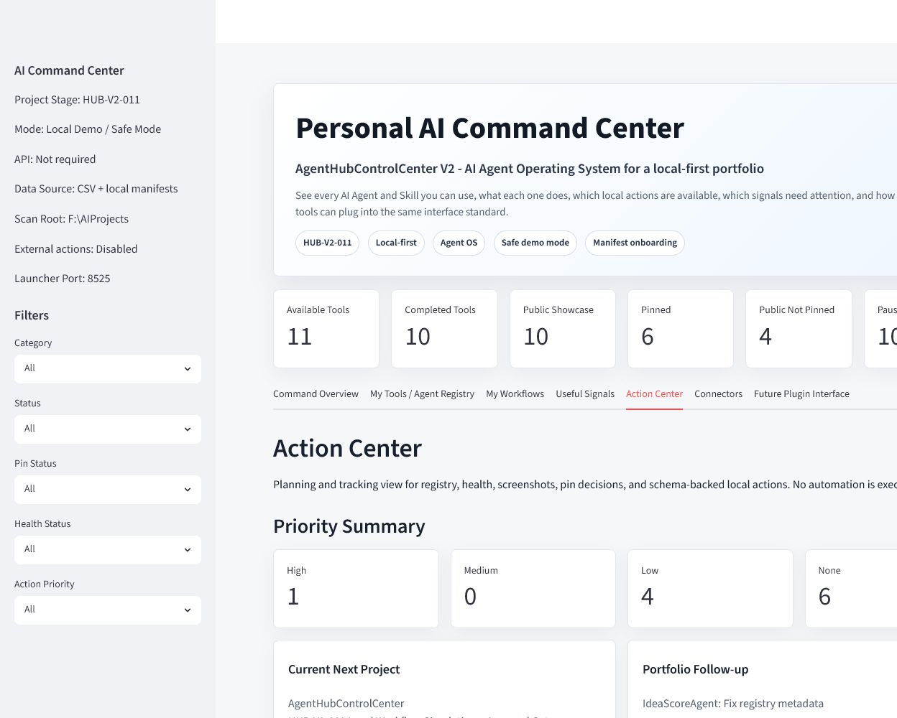
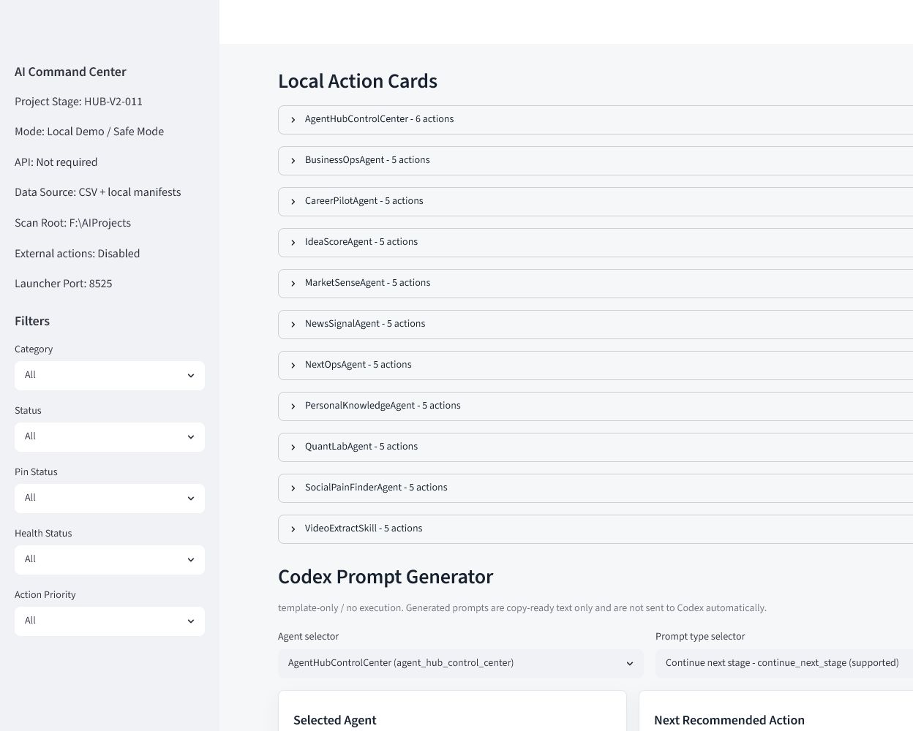
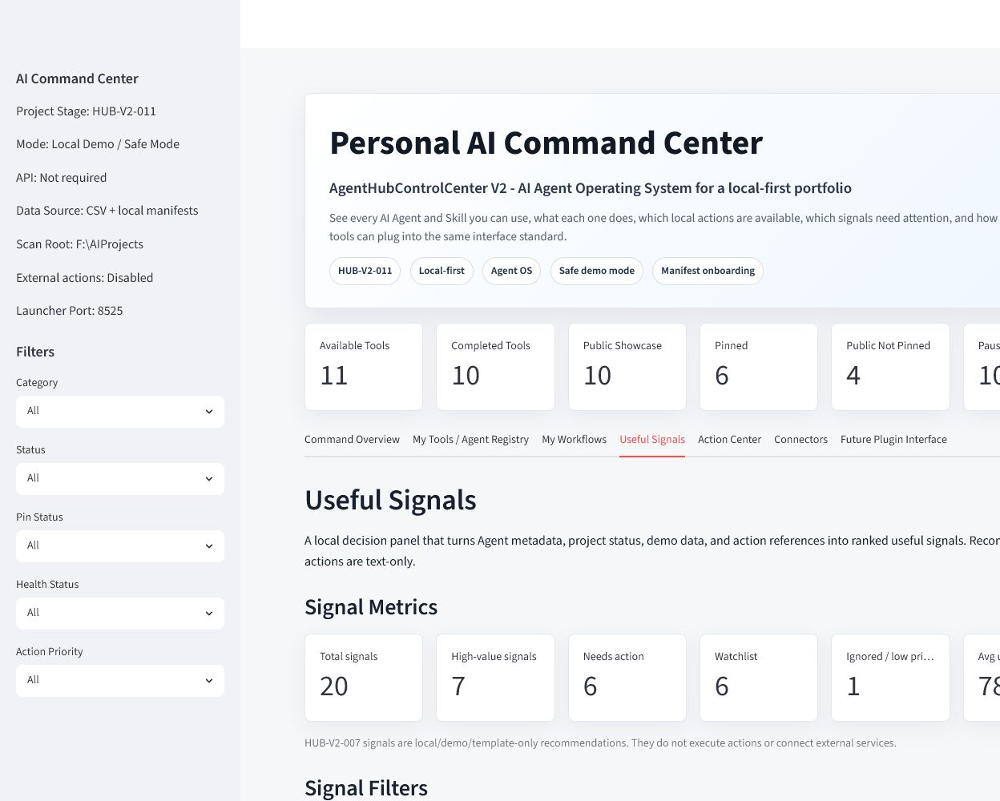
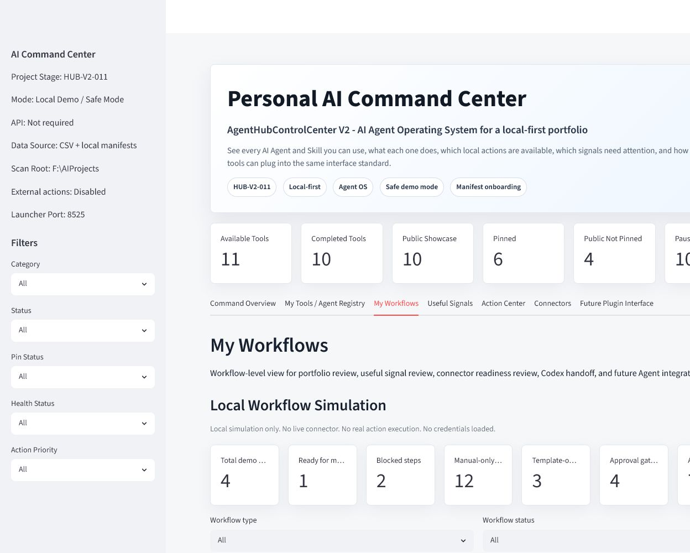
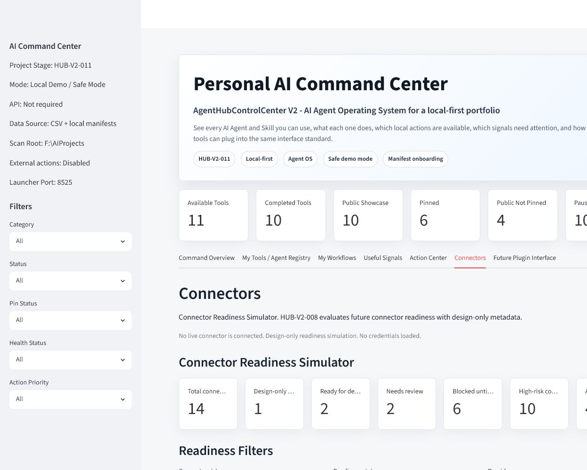
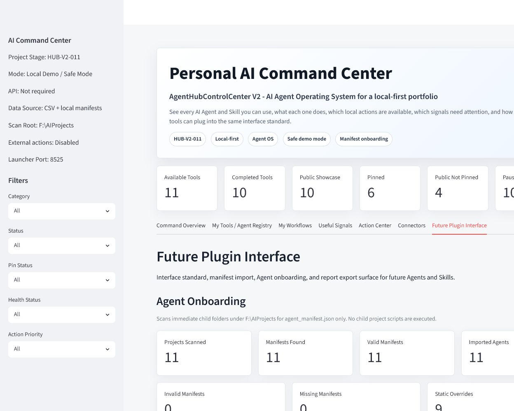
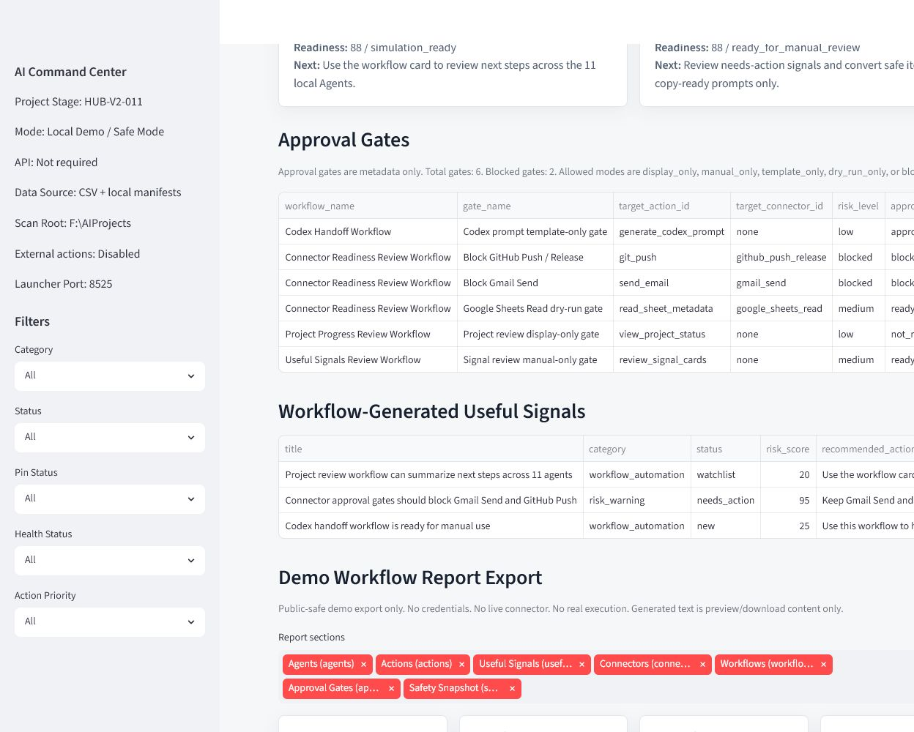
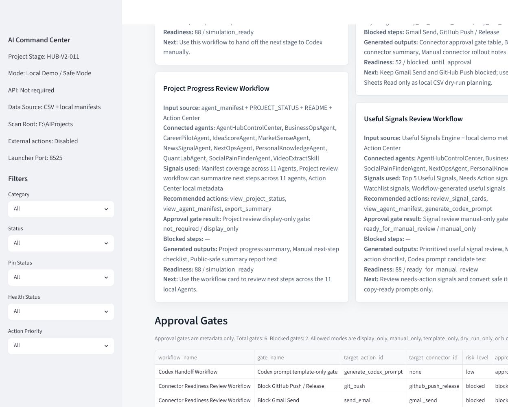

# AgentHubControlCenter

AgentHubControlCenter is a local-first Personal AI Command Center for managing
AI Agent and Skill portfolio projects. V2 upgrades the app from a single
portfolio dashboard into an AI Agent Operating System entry point: tools,
workflows, useful signals, action center, connectors, and future plugin
interface.

Current status: HUB-V2-023-BILINGUAL-UI-DOCS-COMMIT-COMPLETE

Portfolio positioning: this repo is the hub project for showing how 12
local-first AI Agents and Skills can be organized into one safe, inspectable
AgentOps workflow system.

Safety mode: public-safe metadata only; no live connector, no credential load,
no child project script, and no real action execution.

## What It Does

- Loads a local CSV registry of AI Agent and Skill projects.
- Validates registry metadata quality and missing required fields.
- Summarizes portfolio status, showcase coverage, pinned items, public-but-not-pinned projects, and paused/completed projects.
- Checks whether each local project path contains expected public-project files.
- Builds a capability matrix and positioning summary for the portfolio.
- Builds a fixed project matrix view across Finance / Market, Media / OCR / Extraction, Career, News / Signal, SME Automation, Client Delivery / AI Consulting, Knowledge Base, and Control Center / Meta Agent.
- Plans prioritized next actions from validation, health, screenshots, and pin status.
- Provides a local Chinese / English UI toggle for the main command center surfaces.
- Shows Product Status, Latest Checkpoint, and Manifest Version separately instead of a stale hard-coded stage label.
- Displays local command packs for manual launch, folder open, tests, and git status.
- Generates an enhanced Markdown portfolio report for download or local saved export.
- Builds a Command Center Summary and public-safe showcase asset checklist.
- Builds a Priority Action Summary for paused projects, future commercial candidates, GitHub showcase projects, and future AgentHub integration candidates.
- Shows a V2 Command Overview for what tools are available, what they can do, and what the recommended next action is.
- Defines a standard Agent manifest and contract for future Agent onboarding.
- Scans `F:\AIProjects` child project folders for `agent_manifest.json`.
- Validates manifest fields and shows onboarding warnings instead of crashing.
- Merges valid manifest records with `data/agent_registry.csv` at runtime.
- Shows source labels: `static_registry`, `local_manifest`, and `demo_manifest`.
- Shows connector readiness without enabling live Gmail, Google Sheets, Notion, Airtable, Telegram, or other external account actions.
- Defines a unified local action schema for every onboarded Agent.
- Shows Action Center metrics for total actions, manual-only actions,
  display-only actions, future connector actions, required approvals, and
  blocked actions.
- Shows schema-backed action cards grouped by Agent with risk level, approval
  flag, expected output, safety note, and manual runbook reference.
- Provides manual runbook and action safety policy docs before any future
  execution stage.
- Generates copy-ready Codex prompts from Agent manifests, local action
  metadata, checkpoint context, safety rules, validation requirements, and next
  recommended actions.
- Scores local/demo Useful Signals from manifest, project status, report,
  action registry, local JSON/CSV, and manual demo metadata.
- Shows ranked recommendations with usefulness, relevance, urgency,
  actionability, value, and risk scores without executing any action.
- Simulates future connector readiness for Gmail, Google Sheets, Google Drive,
  Notion, Airtable, Telegram, GitHub, n8n, Make, and Zapier without connecting
  live accounts.
- Shows connector permissions, approval gates, risk level, rollback plan, test
  plan, readiness score, and recommended next step.
- Simulates local demo workflows that chain Agent manifests, Useful Signals,
  Action Center metadata, Approval Gates, Manual Runbook references, Codex
  prompts, and summary outputs.
- Shows Approval Gates for display-only, manual-only, template-only,
  dry-run-only, and blocked workflow steps without enabling real execution.
- Exports public-safe demo workflow reports as Markdown, JSON, and CSV text from
  local metadata only.
- Provides a Windows desktop launcher path for opening the command center on port `8525`.

## Why This Project Matters

As the portfolio grows, each project needs a clear operational view: what exists,
where it lives, whether the local files are healthy, what it demonstrates, and
what needs attention next. This app acts as a PortfolioOps dashboard for a
local-first AI workflow ecosystem.

## Portfolio Matrix

AgentHubControlCenter is the hub-and-spoke entry point for the current local AI
Agent and Skill portfolio.

| Project | Category | Role in AgentHub | GitHub status | Backlink status | Manifest status | Public-safe status | Next note |
| --- | --- | --- | --- | --- | --- | --- | --- |
| AgentHubControlCenter | Hub / AgentOps Command Center | Main portfolio command center and review hub | Published | Hub project | Valid root manifest | Public-safe metadata only | Keep pinned as the main portfolio hub |
| BusinessOpsAgent | SME operations | Business workflow and operations node | Published | Backlink live | Valid manifest | Public-safe | Keep as applied SME workflow example |
| CareerPilotAgent | Career operations | Career planning and job workflow node | Published | Backlink live | Valid manifest | Public-safe | Keep as practical user-facing workflow example |
| ClientDeliveryKitAgent | Client delivery / AI automation consulting | Client-facing delivery workflow spoke | Published: `https://github.com/CHENXJC/ClientDeliveryKitAgent` | Backlink live | Valid published manifest | Public-safe synthetic demo | Optional profile pin / maintain showcase |
| IdeaScoreAgent | Idea validation | Business idea scoring and validation node | Published | Backlink live | Valid manifest | Public-safe | Excluded deploy/report/bat artifacts remain local-only |
| MarketSenseAgent | Market intelligence | Market watch and local automation node | Local-only non-git | Backlink local-only | Valid local manifest | Public-safe local metadata | Needs separate repo decision before publishing |
| NewsSignalAgent | News intelligence | News signal analysis node | Published | Backlink live | Valid manifest | Public-safe | Keep as signal analysis example |
| NextOpsAgent | SME next-action recommendations | Operational next-action recommendation node | Published | Backlink live | Valid manifest | Public-safe | Keep as next-action workflow example |
| PersonalKnowledgeAgent | Knowledge management | Personal knowledge workflow node | Published | Backlink live | Valid manifest | Public-safe demo boundary | Keep knowledge workflow positioning clear |
| QuantLabAgent | Quant research | Research, backtesting, and risk analysis node | Published | Backlink live | Valid manifest | Public-safe research/demo boundary | Keep investment disclaimer visible |
| SocialPainFinderAgent | Opportunity discovery | Pain-point and opportunity discovery node | Published | Backlink live | Valid manifest | Public-safe | Keep as business opportunity discovery example |
| VideoExtractSkill | Content intelligence | Video/image content extraction node | Local-only non-git | Backlink local-only | Valid local manifest | Public-safe local metadata | Needs separate repo decision before publishing |

## Screenshots

### Command Center Overview



Public-safe command center home view with portfolio metrics, 12 available
tools, and first-row Agent cards.

### Agent Registry



My Tools / Agent Registry view showing 12 manifest-onboarded local Agents and
Skills with source, demo-mode, safe-mode, action, and connector badges.

### Action Center



Local Action Schema metrics, policy-safe action table, and Agent-grouped action
cards. All actions remain display/manual/template/planned metadata only.

### Codex Prompt Generator



Template-only prompt generator with Agent selector, prompt type selector,
safety checklist, validation checklist, preview, and copy-ready text area.

### Useful Signals



Scored local/demo recommendations for project progress, connector readiness,
workflow automation, portfolio improvement, and risk warnings.

### Workflow Simulation



My Workflows page showing local workflow simulation metrics and filters. No
live connector, credential, child script, or real action is executed.

### Connectors



Connector readiness view showing local, link-based, planned, optional, and
not-connected surfaces without enabling live account integrations.

### Agent Onboarding Metrics



Agent onboarding metrics showing 12 manifests found, 12 valid manifests, 0
invalid manifests, and 0 missing manifests.

### Report Export



Demo Workflow Report Export preview for Markdown, JSON, and CSV public-safe text
reports under `outputs/public_reports/`.

### Approval Gates



Approval Gates table showing blocked/manual/template-only workflow steps and
policy state for high-risk connector ideas.

## Core Features

- Product-style Streamlit dashboard
- Personal AI Command Center hero section
- Command Overview page
- My Tools / Agent Registry page
- My Workflows page
- Useful Signals page
- Action Center page
- Connectors page
- Future Plugin Interface page
- Agent Onboarding section
- Manifest discovery and validation
- CSV + manifest runtime registry merge
- Manifest-based Agent onboarding for 12 local Agents and Skills
- HUB-V2-005+ local action schema for 66 metadata-only actions across 12 Agents
- HUB-V2-006 Codex Prompt Generator for copy-ready text prompts
- HUB-V2-007 Useful Signals Engine for scored local recommendations
- HUB-V2-008 Connector Readiness Simulator for design-only connector planning
- HUB-V2-009 Local Workflow Simulation + Approval Gates for demo workflow review
- HUB-V2-010 Demo Workflow Report Export for Markdown / JSON / CSV public-safe
  reporting
- HUB-V2-011 refreshed 10-screenshot showcase set and sample public-safe report
  summary
- HUB-V2-012 public showcase release checklist and readiness report
- HUB-V2-013 GitHub showcase update decision, public commit manifest, and
  public exclusion manifest
- HUB-V2-014 public-safe git commit, push, and live GitHub showcase
  verification
- HUB-V2-015 Profile Pin / Portfolio Placement Decision with portfolio
  positioning copy
- HUB-V2-022 bilingual UI toggle and Project Stage sync check
- HUB-V2-023 bilingual UI docs commit and remote sync
- Manual runbook references for safe human operation
- Action safety policy for blocked or approval-required action classes
- Reviewed V2 Agent cards with category, source, demo-mode, safe-mode, action,
  and connector badges
- Six metric cards
- Agent registry table with sidebar filters
- Agent detail panel
- Command pack display
- Registry validation with quality scores
- Health overview cards
- Priority action cards
- Portfolio matrix and capability clusters
- Fixed project matrix view
- Screenshot-ready layout
- Enhanced Markdown report generation and download
- Saved local report export to `outputs/`
- Command Center report summary
- Priority action summary
- Public showcase readiness section
- Showcase asset checklist
- Standard Agent interface docs and JSON examples
- Codex Prompt Generator docs and text-only prompt policy
- Windows one-click command launcher

## Current MVP Status

HUB-V2-022 completes the bilingual UI toggle and stage status sync check. The
Streamlit sidebar now offers `中文` and `English`, defaults to Chinese, and
keeps all translations local through `agent_hub/ui_i18n.py`. The sidebar now
separates Product Status, Latest Checkpoint, and Manifest Version through
`agent_hub/stage_status.py`, so the UI no longer displays the stale hard-coded
`HUB-V2-014` value or treats a cross-project sync checkpoint as the product
stage. This is display-only UI polish; it does not execute actions or connect
live providers.

CLIENTDELIVERYKIT-010 completes the published status sync for
ClientDeliveryKitAgent after live GitHub showcase verification. AgentHubControlCenter
now clearly presents itself as the hub-and-spoke entry point for 12 local-first
AI Agents and Skills, with 9 published child repo backlinks, 2 local-only
non-git project notes, valid manifests, public-safe boundaries, and no real
execution.

HUB-V2-018 completed the explicit cross-project backlink commit stage. Eight
eligible child repos were committed and pushed with exact `README.md` and
`agent_manifest.json` file paths; MarketSenseAgent and VideoExtractSkill remain
local-only non-git directories; IdeaScoreAgent deploy/report/bat artifacts
remain untracked and excluded.

HUB-V2-015 completes the GitHub Profile pin / portfolio placement decision. The
decision is to strongly recommend pinning AgentHubControlCenter because it is
the portfolio hub that best represents the user's AI Agent matrix, workflow
automation thinking, safety gates, and AI automation consultant positioning.

HUB-V2-014 completed the authorized public showcase commit/push verification
stage on top of the HUB-V2-013 GitHub showcase update decision. It used
`docs/PUBLIC_COMMIT_FILE_MANIFEST.md` as the exact staging source, keeps
generated public reports excluded, commits only public-safe project files, and
verifies the live GitHub README, screenshot assets, docs, and remote tree after
push.

HUB-V2-013 completed a local GitHub showcase update decision on top of the
HUB-V2-012 public release check. It classified the working tree into
recommended public commit files and intentional exclusions, recorded a suggested
staging plan for the explicit commit stage, and confirmed the generated
report/output boundaries remain public-safe.

HUB-V2-012 completed the local public showcase release check on top of the V2
action schema, manual runbook, Codex Prompt Generator, Useful Signals Engine,
Connector Readiness Simulator, Local Workflow Simulation, Approval Gates, and
Demo Workflow Report Export layers. It verified the 10-image screenshot set,
sample public-safe report summary, manifest/contract JSON, launcher,
`.gitignore` boundaries, policy counts, and release-readiness docs for
GitHub/portfolio review.

The My Workflows page now includes workflow simulation metrics, workflow cards,
Approval Gates, workflow-generated Useful Signals, and Demo Workflow Report
Export previews/downloads. Each workflow remains
`local_simulation_only_no_live_connector_no_real_action_no_credentials`, and
report export remains `public_safe_demo_report_metadata_only_no_execution`.

The Connectors page still includes readiness metrics, risk/status/provider
filters, connector cards, readiness table, and connector-generated Useful
Signals. Each connector remains `not_connected` and
`design_only_readiness_simulation_no_live_connection`.

The V2 stack now sits on top of
the completed HUB-V2-001 / HUB-V2-001A command center and launcher work, the
HUB-V2-002 safe discovery layer, the HUB-V2-003 child manifests, and the
HUB-V2-004 registry/screenshot review.

It does not call OpenAI APIs, does not create OAuth flows, does not create
credentials, does not execute child project scripts, does not execute action
command templates, does not connect external accounts, and does not auto-send
generated prompts or recommendations anywhere. GitHub push is only performed in
the explicit V2-014 release stage authorized by the user, without changing git
remotes or using force push.

Current local scan result:

- Total projects scanned: 12
- Manifests found: 12
- Valid manifests: 12
- Invalid manifests: 0
- Missing manifests: 0
- Imported agents: 12
- Duplicate agent IDs: 9 static registry overrides

Current local action result:

- Total actions: 66
- Manual-only actions: 19
- Display-only actions: 34
- Future connector actions: 0
- Requires approval: 3
- Blocked actions: 0
- Policy violations: 0

Current useful signal result:

- Demo/local useful signals: 20 including 3 connector-generated signals and 3
  workflow-generated signals
- Execution policy: `display_only_text_recommendation_no_execution`
- Real action execution: 0

Current connector readiness result:

- Demo connectors: 14
- Design-only connectors: 1
- Ready for demo: 2
- Needs review: 2
- Blocked until approved: 6
- High-risk connectors: 10
- Average readiness score: 44.9
- Live connectors connected: 0
- Connector policy violations: 0

Current local workflow simulation result:

- Demo workflows: 4
- Workflow-generated Useful Signals: 3
- Live connectors connected: 0
- Real workflow execution: 0
- Workflow policy violations: 0
- Approval gate policy violations: 0

Current demo workflow report export result:

- Available report sections: 7
- Export formats: Markdown, JSON, CSV
- Output directory: `outputs/public_reports/`
- Report export policy: `public_safe_demo_report_metadata_only_no_execution`
- Report export policy violations: 0

Current showcase refresh result:

- Canonical screenshots: 10 under `docs/images/`
- Sample report summary: `docs/SAMPLE_DEMO_WORKFLOW_REPORT_SUMMARY.md`
- Screenshot public-safe review: no `.env`, secret, token, password, API key,
  credential, private output, live connector data, or real execution visible
- Public-safe report source checked: latest Markdown/JSON/CSV files under
  `outputs/public_reports/`

Current release readiness result:

- Public release checklist: `docs/PUBLIC_RELEASE_CHECKLIST.md`
- V2 release readiness report: `docs/V2_RELEASE_READINESS_REPORT.md`
- README/docs/screenshots consistency: ready
- Manifest/contract JSON validation: ready
- Public reports boundary: generated report files remain ignored; `.gitkeep` is
  the only intended tracked file under `outputs/public_reports/`
- Release recommendation: ready for a separate explicit commit/push decision

## Registered Agents

- AgentHubControlCenter
- ClientDeliveryKitAgent
- VideoExtractSkill
- MarketSenseAgent
- QuantLabAgent
- SocialPainFinderAgent
- CareerPilotAgent
- NewsSignalAgent
- PersonalKnowledgeAgent
- BusinessOpsAgent
- NextOpsAgent
- IdeaScoreAgent

## Tech Stack

- Python 3.11+
- Streamlit
- pandas
- pytest

## How To Run

```powershell
cd F:\AIProjects\AgentHubControlCenter
python -m pip install -r requirements.txt
streamlit run app.py
```

Desktop launcher:

```powershell
cd F:\AIProjects\AgentHubControlCenter
.\launch_command_center.cmd
```

Create desktop shortcut:

```powershell
cd F:\AIProjects\AgentHubControlCenter
powershell -ExecutionPolicy Bypass -File .\scripts\create_desktop_shortcut.ps1
```

Run tests:

```powershell
cd F:\AIProjects\AgentHubControlCenter
python -m pytest
python -m compileall .
```

## Safety Boundary

This dashboard is for local portfolio management and workflow planning only. It
does not execute external actions or access private credentials.

The project intentionally avoids `.env` creation, API integrations, token reads,
credential storage, remote initialization, remote modification, and force push.
HUB-V2-014 performs only the explicitly authorized public-safe git staging,
commit, normal push, and live showcase verification. Connectors, workflows,
approval gates, reports, screenshots, and sample summaries are shown as
local/demo/planned/readiness/simulation/export/showcase surfaces only. Manifest
discovery only reads `agent_manifest.json` files from immediate child project
folders, and child project actions remain display/manual/template/planned
metadata. Generated Codex prompts and Useful Signals recommendations are
text-only planning artifacts. Connector readiness records are design-only
metadata and do not load credentials or call provider APIs. Workflow simulations
and Approval Gates are metadata-only and do not execute real actions. Demo
Workflow Report Export writes only public-safe text under `outputs/public_reports/`
when local file export is used, and does not write `outputs/private/`. The
showcase refresh only updates public-safe docs and screenshots. The bilingual
UI toggle uses a local dictionary only and does not call translation APIs.

## Roadmap

- GitHub Public Release: complete.
- HUB-V2-001 Unified Command Center Entry + Desktop Launcher: complete.
- HUB-V2-001A Desktop Launcher Runtime Fix: complete.
- HUB-V2-002 Manifest Import + Agent Onboarding Flow: complete.
- HUB-V2-003 Child Agent Manifest Templates: complete.
- HUB-V2-004 V2 Onboarding Screenshot Refresh + Registry Review: complete.
- HUB-V2-005 Local Action Schema + Manual Runbook: complete.
- HUB-V2-006 Codex Prompt Generator: complete.
- HUB-V2-007 Useful Signals Engine: complete.
- HUB-V2-008 Connector Readiness Simulator: complete.
- HUB-V2-009 Local Workflow Simulation + Approval Gates: complete.
- HUB-V2-010 Demo Workflow Report Export: complete.
- HUB-V2-011 Report Showcase / Screenshot Refresh: complete.
- HUB-V2-012 Public Showcase Release Check: complete.
- HUB-V2-013 GitHub Showcase Update Decision: complete.
- HUB-V2-014 Git Commit / Push / Live Showcase Verification: complete.
- HUB-V2-015 Profile Pin / Portfolio Placement Decision: complete.
- HUB-V2-016 Cross-Project Backlink Plan: complete.
- HUB-V2-017 Cross-Project Backlink Commit Decision: complete.
- HUB-V2-018 Cross-Project Backlink Explicit Commit: complete.
- HUB-V2-019 Portfolio Matrix Final Review: complete.
- HUB-V2-020 Project Pause and Next Portfolio Gap Decision: complete.
- HUB-V2-021 AgentHub Pause Docs Commit: complete.
- HUB-V2-022 Bilingual UI Toggle and Stage Sync Check: complete.
